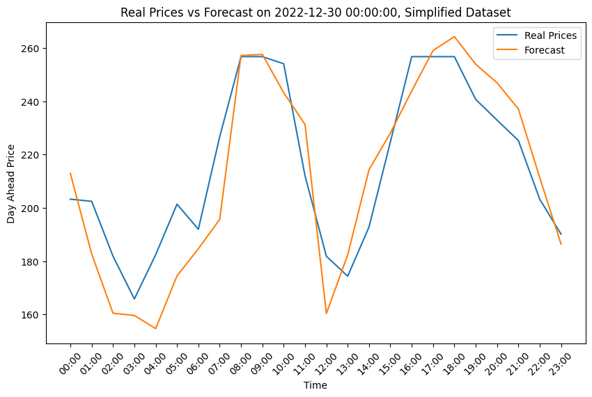
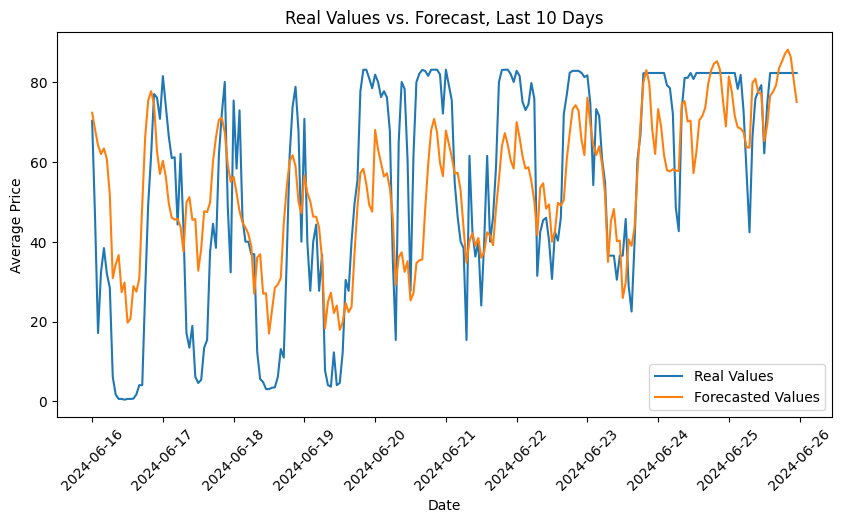
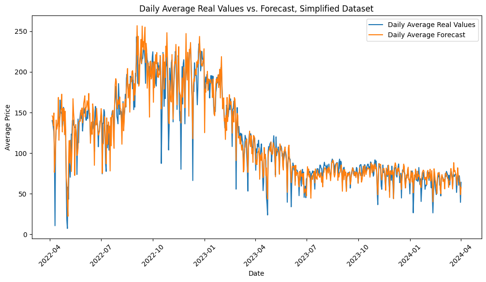
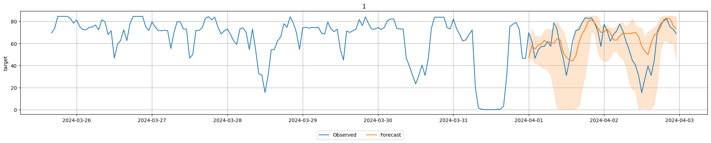
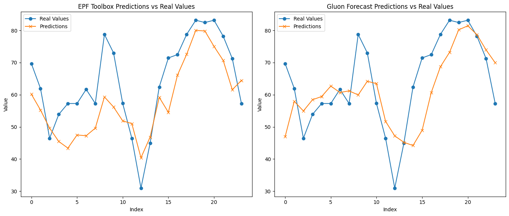
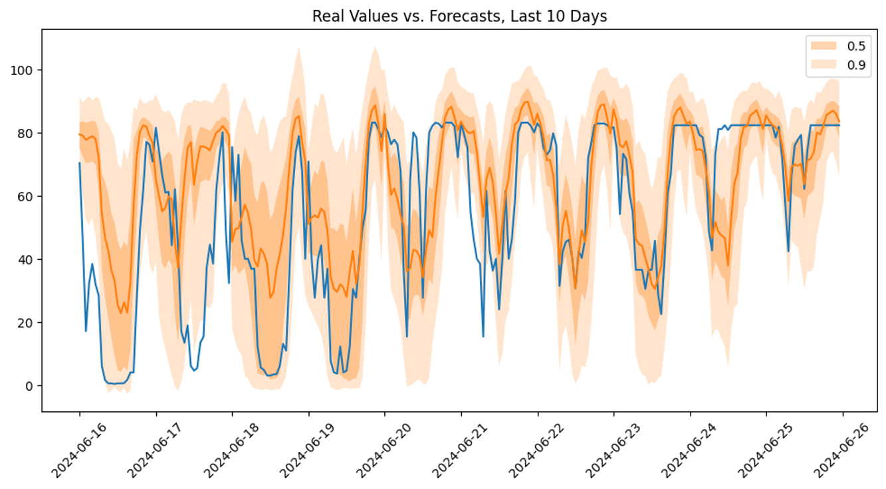
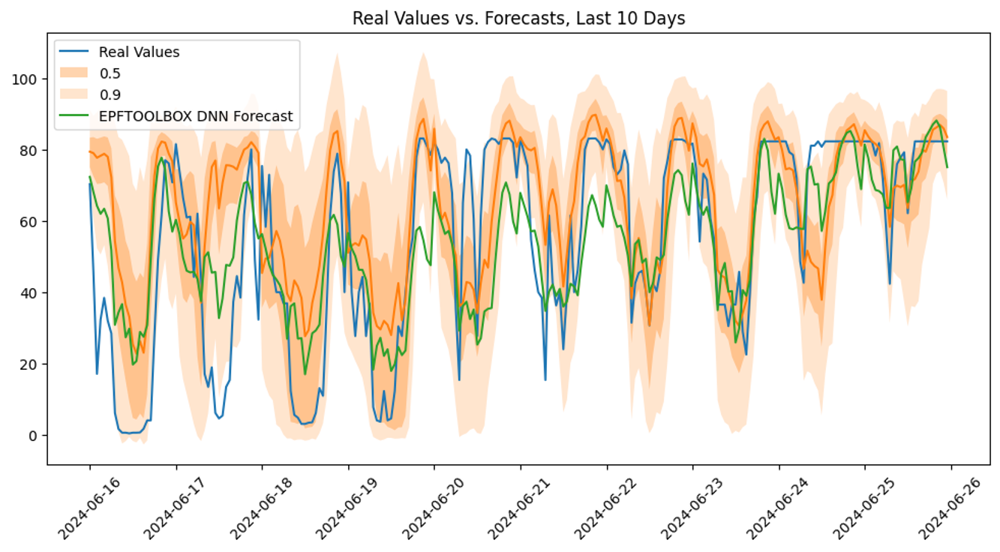

# Electricity Price Forecasting
Past experiments made with the goal of forecasting electricity prices. The data used in these experiments is the the Day Ahead Prices of Turkey Market, fetched using [Electricity Price Fetcher](https://github.com/rojenarda/electricity_data_fetching_tr) from the EPIAS API.

# EPFToolBox DNN Model (epftoolbox_dnn_live_model.py)
Live model training and forecasting using [EPFToolBox's DNN Model](https://github.com/jeslago/epftoolbox). Install the EPFToolBox library, then set a cronjob to run this script every day. Complete example.

The model is tuned using EPFToolBox's  hyperparameter optimizer. The model is trained with the data from 2017 until today everyday, and a forecast is made for the next day. 

### An example of the model's predictions for a single day can be seen in the following plot:

### Prediction plot for 10 days:

### Prediction plot for a large period (trained with 2017-2022 data):

# Timeseries Forecasting Using AutoGluon's Chronos, a Pretrained Univariate Timeseries Forecasting Model (chronos.ipynb)
AutoGluon Chronos, pretreined timeseries forecasting model. Complete example.

## deepar.ipynb
DeepAR PyTorch implementation from GluonTS, a probabilistic, univariate model for timeseries forecasting. Complete example.

The model is tuned with optuna. CometML is used for experiment tracking. Data between 2017-2024 is used for training, and the model is tested on the 2024 data.

### 10 days predictions:

### DeepAR vs EPFToolBox DNN Model, Single Day:

### DeepAR vs EPFToolBox DNN Model, 10 Days:

## pytorch_forecasting.ipynb
Temporal Fusion Transformer and NBeats implementation from PyTorch Forecasting. Incomplete example, no outputs available.

# Data
Example data can be found in the `data` directory. The data is in the format of a CSV. You should use Electricity Price Fetcher to get the latest data.

# Presentations
Presentations made for the experiments can be found in the `presentations` directory.